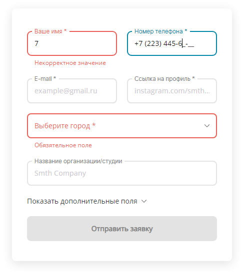

# Форма

## Описание

Компонент создан с использованием [The official Redux template for Create-React-App](https://github.com/reduxjs/cra-template-redux). 
- Имеется валидация. 
- Данные полей хранятся в Redux. 
- При отправке происходит 2-секундная имитация задержки, после чего форма очищается.

## Зависимости
- [styled-components](https://styled-components.com)
- [react-input-mask](https://github.com/sanniassin/react-input-mask)
- [react-select](http://react-select.com)
